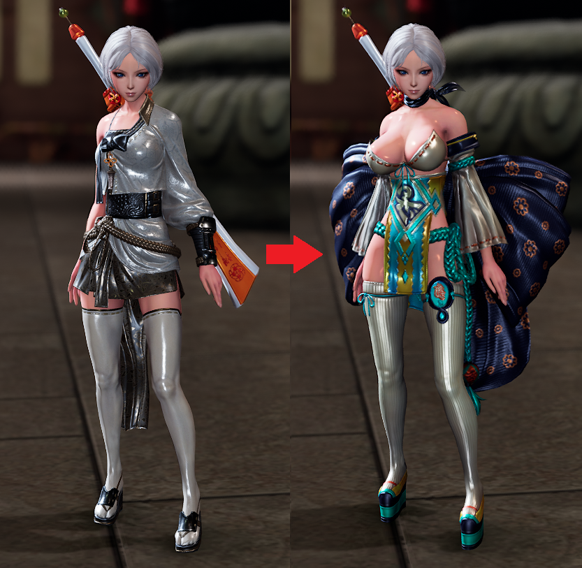

# BNS ItemSwap Plugin

# Disclaimer

**This version of the project is no longer maintained.** Please use the new repository instead: [BnsDatafilePlugin_ItemSwap2](https://github.com/leanleon93/BnsDatafilePlugin_ItemSwap2).

A plugin for BNS NEO that allows you to intercept and modify item data lookups using ImGui for configuration.

## Features

- **Item Swapping**: Swap item data lookups dynamically
- **ImGui Integration**: Built-in UI panels for plugin configuration and item browsing

## Example outfit swap

## Special Ids
- `69696969` - Zulia Outfit  (JinF only)
- `69696970` - Lancer Outfit (Jin only)

## Demo

## Dependencies
- Requires [DatafilePluginloader](https://github.com/leanleon93/BnsPlugin_DatafilePluginloader) to work
